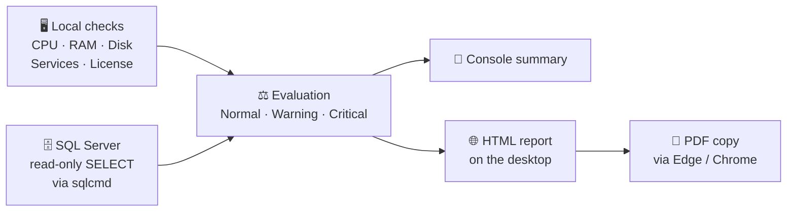

&nbsp;
<h1 align="center">🛡️ Forcepoint DLP Health Check</h1>

<h3 align="center">Is your Forcepoint DLP really healthy? Find out in a few minutes.</h3>

<p align="center">
  A free, single-file and <b>read-only</b> PowerShell health check script for Forcepoint DLP (Security Manager / Content Manager).
</p>

<p align="center">
  🇬🇧 English | <a href="README.md">🇹🇷 Türkçe</a>
</p>

<p align="center">
  <a href="#-quick-start">Quick Start</a> |
  <a href="#-sample-report">Sample Report</a> |
  <a href="#-what-does-it-check">What It Checks</a> |
  <a href="#-security-what-the-script-does-and-does-not-do">Security</a> |
  <a href="#️-usage-examples">Usage</a> |
  <a href="../../issues">Feedback</a>
  <br/><br/>
  
  
  
  
</p>

<p align="center">
  
</p>

<hr/>

**Forcepoint DLP Health Check** is a PowerShell script that runs on the Forcepoint Security Manager / Content Manager server. It checks server resources, Forcepoint services and the Forcepoint DLP database on SQL Server **by reading only**, prints a summary to the console and generates a graphical HTML report (plus a matching PDF) on the desktop.

No installation required. It changes nothing on the system and sends no data out.

Author: **FIRAT AYDIN**

- [Quick start](#-quick-start)
- [Sample report](#-sample-report)
- [Read before you run](#️-read-before-you-run)
- [What does it check?](#-what-does-it-check)
- [Security: what the script does and does not do](#-security-what-the-script-does-and-does-not-do)
- [How it works](#-how-it-works)
- [Requirements](#-requirements)
- [Usage examples](#️-usage-examples)
- [Feedback and disclaimer](#-feedback)

---

## ⚡ 30-second summary

| | |
|---|---|
| **What does it do?** | Reads and reports the state of the Forcepoint DLP server and its SQL Server database |
| **What does it change?** | **Nothing.** Read-only (`SELECT`) |
| **Output** | Console summary + graphical HTML report on the desktop (plus a matching PDF, auto-generated if Edge/Chrome is present) |
| **Where does it run?** | Forcepoint Security Manager / Content Manager server (Windows) |
| **How long does it take?** | A few minutes |

---

## 🌐 Script language variants

Two functionally identical copies are included. Both run the same checks against the same database schema; only the console / report language differs.

| File | Console and report language |
|---|---|
| [`ForcepointDlpHealth.en.ps1`](ForcepointDlpHealth.en.ps1) | English |
| [`ForcepointDlpHealth.ps1`](ForcepointDlpHealth.ps1) | Turkish |

The screenshots below were taken from the English script.

---

## 🚀 Quick start

**1.** Copy the script to the Forcepoint Security Manager server.

**2.** Open PowerShell as Administrator and run:

```powershell
.\ForcepointDlpHealth.en.ps1
```

**3.** The script asks the following, answer in order:

| Question | Example |
|---|---|
| Customer name *(can be left empty)* | `Example Corp` |
| SQL Server name | `SQL01` or `SQL01\INSTANCE` |
| Authentication type: `1` Windows (default) / `2` SQL Server login | `1` |
| SQL user and password *(only for option 2, password input is hidden)* | `fp_readonly` / `********` |

**4.** When it finishes, open `<CustomerName>_FP_DLP_HC_<date>.html` on your desktop. If Microsoft Edge or Google Chrome is present, a matching `.pdf` copy is generated automatically. ✅

> [!TIP]
> To run only the server checks without connecting to the database: `.\ForcepointDlpHealth.en.ps1 -SkipDatabaseCheck`

> [!TIP]
> If no customer name is entered, the report file name uses the computer name instead. If Edge or Chrome is not found, the PDF step is skipped and the HTML report is still generated.

---

## 📸 Sample report

Sections of the HTML report the script writes to the desktop. Server names, IP addresses and license details are blurred.

**System information and hardware comparison**


**Overall summary and health findings**


**Active channels and Endpoint Status**


<details>
<summary><b>More screenshots (click to expand)</b></summary>

<br/>

**Forcepoint / Websense services**


**License status**


**Deployed components**


**Policy summary**


**Most violated policies, senders/users and incident summary**


**Console users, roles and integration status**


> The same report is also generated automatically as a PDF alongside the HTML file (see [Quick start](#-quick-start)).

</details>

---

## ⚠️ Read before you run

> [!IMPORTANT]
> Use it only on systems you are **authorized** to access. Try it in a **test environment** first.

> [!WARNING]
> **With SQL Server authentication the password may be visible on the command line.**
> The script passes the connection details to `sqlcmd.exe` as command-line arguments. While the script runs, another privileged user logged on to the same machine could see them.
> **Fix:** Use Windows Authentication (the default), or a dedicated SQL account with **read-only** privileges.

> [!WARNING]
> **The report contains corporate data.**
> Policy names, host names, IP addresses, user names and incident counts end up in the report. Review it before sharing.

> [!NOTE]
> **Version differences are possible.** The queries were validated against Forcepoint DLP 10.4. Some sections may be empty on other versions. On the first run, compare the results with the FSM console.

---

## 🔍 What does it check?

| Area | What is checked |
|---|---|
| 🖥️ **Server** | CPU, RAM, disk, uptime, comparison with the official Forcepoint hardware recommendation |
| ⚙️ **Services** | Forcepoint / Websense Windows services, Windows Event Log errors and warnings |
| 🔑 **License** | Valid / expiring soon / expired, per-product limits |
| 🧩 **Components** | Deployed components, last deployment status, version consistency |
| 📡 **Channels** | Active channels / services, Monitoring vs. Blocking mode |
| 💻 **Endpoint Status** | Agent version distribution, enabled / disabled agents, agents whose last update is older than 7 days (expandable host list), synchronization, Discovery status, bypass codes generated |
| 📊 **Incidents** | Totals, type, detection server, status, archive partitions |
| 📋 **Policies** | Total / enabled / disabled, policies with no incidents, most violated policies and rules |
| 👥 **Console access** | Users, roles, disabled accounts |
| 🔗 **Integrations** | AD / LDAP sync, OCR, MIP, RMS, File Labeling, Syslog |
| 🗄️ **SQL Server** | Connection, disk space of the database server |

All findings are marked **Normal / Warning / Critical / Unknown** and collected in a single **Health Findings** table.

---

## 🔐 Security: what the script does and does not do

| ✅ Does | ❌ Does not |
|---|---|
| Sends only `SELECT` to SQL Server | Run `INSERT` / `UPDATE` / `DELETE` / DDL |
| Asks for the SQL password masked and clears it from memory after use | Write the password to disk |
| Keeps data on the local machine | Send any data out (no internet, cloud or e-mail) |
| Deletes temporary files when done | Read console users' password fields |
| Is a single, readable script | Contain anything hidden or embedded |

Temporary files are written under `C:\ProgramData\FpDlpHealthTemp` and deleted when the run finishes (unless `-KeepTempSqlFiles` is used).

---

## 🧠 How it works



1. **Local checks:** CPU, RAM, disk, services, event log and the license file are read.
2. **SQL Server checks:** Only read queries are run through `sqlcmd.exe`.
3. **Evaluation:** Each finding is marked **Normal / Warning / Critical** against thresholds.
4. **Report:** A summary is printed to the console, an offline HTML file with no external libraries is written to the desktop, and a PDF copy is created if Edge or Chrome is available.

---

## 📋 Requirements

- Windows PowerShell **5.1+**
- Run **locally** on the Forcepoint Security Manager / Content Manager server (there is no remote-target parameter)
- `sqlcmd.exe` in `PATH` (only for the database check)
- Read access to the `wbsn-data-security` database (Windows Authentication by default, or a SQL login)
- *(Optional)* Microsoft Edge or Google Chrome for the PDF output. If neither is present, only the HTML report is generated, with no error

---

## 🎛️ Usage examples

```powershell
# Interactive (recommended)
.\ForcepointDlpHealth.en.ps1

# Provide customer name and SQL Server up front
.\ForcepointDlpHealth.en.ps1 -CustomerName "Example Corp" -SqlServerInstance "SQL01\INSTANCE"

# Server checks only, no database connection
.\ForcepointDlpHealth.en.ps1 -SkipDatabaseCheck

# SQL login instead of Windows Authentication
.\ForcepointDlpHealth.en.ps1 -SqlAuthMode SqlLogin -SqlUserName "fp_readonly"

# Change thresholds
.\ForcepointDlpHealth.en.ps1 -CpuWarningPercent 75 -DiskCriticalFreePercent 8
```

<details>
<summary><b>📑 All parameters (click to expand)</b></summary>

<br/>

| Parameter | Default | Description |
|---|---|---|
| `CpuWarningPercent` | 70 | CPU usage % that triggers a Warning |
| `CpuCriticalPercent` | 85 | CPU usage % that triggers a Critical |
| `MemoryWarningUsedPercent` | 80 | Memory used % that triggers a Warning |
| `MemoryCriticalUsedPercent` | 90 | Memory used % that triggers a Critical |
| `DiskWarningFreePercent` | 20 | Free disk space % below which a Warning is raised |
| `DiskCriticalFreePercent` | 10 | Free disk space % below which a Critical is raised |
| `CpuSampleCount` | 5 | Number of CPU samples to average |
| `CpuSampleIntervalSeconds` | 1 | Seconds between CPU samples |
| `SqlServerInstance` | *(asked)* | SQL Server name / instance |
| `SqlDatabaseName` | `wbsn-data-security` | Forcepoint DLP database name |
| `SqlAuthMode` | `Windows` | `Windows` or `SqlLogin` |
| `SqlUserName` | *(empty)* | SQL login user name (for `SqlLogin`; password is asked masked) |
| `IncidentLookbackDays` | 30 | Lookback window (days) for incident, policy and bypass statistics |
| `LicenseWarningDays` | 60 | Days before expiry that raise a license Warning |
| `EventLogLookbackDays` | 7 | Days of Windows Event Log history to scan |
| `CustomerName` | *(asked)* | Shown in the report header and used in the file name |
| `SkipDatabaseCheck` | *(switch)* | Skip the SQL Server check entirely |
| `KeepTempSqlFiles` | *(switch)* | Keep the temporary SQL / result files (also copied to the desktop) for troubleshooting |

</details>

<details>
<summary><b>🔎 Known limitations (click to expand)</b></summary>

<br/>

- The script must run on the Forcepoint server itself; it cannot check a remote server.
- The queries were validated against Forcepoint DLP 10.4. Other versions may show empty sections.
- A bypass code entry (from the audit log) is an event record, not a live state. It does not show whether the code is still valid.
- Connection address and SSL details of AD / LDAP are not stored in the database, so they are not shown.

</details>

---

## 🤝 Feedback

Please share bugs, suggestions and your test results on different Forcepoint DLP versions as an Issue. Contributions are welcome.

## ⚖️ Disclaimer

This script is provided **as is**, without any warranty. Use it only on systems you are authorized to access. Before running it in production, review the source code and try it in a test environment. The user is responsible for any consequences of its use.

<p align="center"><b>FIRAT AYDIN</b></p>
