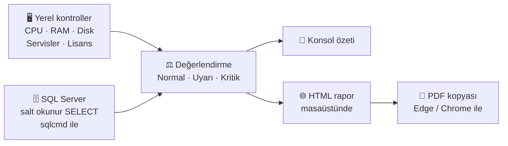

&nbsp;
<h1 align="center">🛡️ Forcepoint DLP Health Check</h1>

<h3 align="center">Forcepoint DLP sisteminiz gerçekten sağlıklı mı? Birkaç dakikada öğrenin.</h3>

<p align="center">
  Forcepoint DLP (Security Manager / Content Manager) için ücretsiz, tek dosyalık ve <b>salt okunur</b> bir PowerShell sağlık kontrol scripti.
</p>

<p align="center">
  <a href="README.en.md">🇬🇧 English</a> | 🇹🇷 Türkçe
</p>

<p align="center">
  <a href="#-hızlı-başlangıç">Hızlı Başlangıç</a> |
  <a href="#-örnek-rapor">Örnek Rapor</a> |
  <a href="#-neleri-kontrol-eder">Neleri Kontrol Eder</a> |
  <a href="#-güvenlik-script-ne-yapar-ne-yapmaz">Güvenlik</a> |
  <a href="#️-kullanım-örnekleri">Kullanım</a> |
  <a href="../../issues">Geri Bildirim</a>
  <br/><br/>
  
  
  
  
</p>

<p align="center">
  
</p>

<hr/>

**Forcepoint DLP Health Check**, Forcepoint Security Manager / Content Manager sunucusunda çalışan bir PowerShell scriptidir. Sunucu kaynaklarını, Forcepoint servislerini ve SQL Server üzerindeki Forcepoint DLP veritabanını **sadece okuyarak** kontrol eder; konsola bir özet basar, masaüstüne grafikli bir HTML rapor (ve aynı raporun PDF kopyasını) üretir.

Kurulum gerektirmez. Sistemde hiçbir şeyi değiştirmez, dışarıya veri göndermez.

Hazırlayan: **FIRAT AYDIN**

- [Hızlı başlangıç](#-hızlı-başlangıç)
- [Örnek rapor](#-örnek-rapor)
- [Çalıştırmadan önce okuyun](#️-çalıştırmadan-önce-okuyun)
- [Neleri kontrol eder?](#-neleri-kontrol-eder)
- [Güvenlik: script ne yapar, ne yapmaz](#-güvenlik-script-ne-yapar-ne-yapmaz)
- [Nasıl çalışır?](#-nasıl-çalışır)
- [Gereksinimler](#-gereksinimler)
- [Kullanım örnekleri](#️-kullanım-örnekleri)
- [Geri bildirim ve sorumluluk reddi](#-geri-bildirim)

---

## ⚡ 30 saniyelik özet

| | |
|---|---|
| **Ne yapar?** | Forcepoint DLP sunucusunun ve SQL Server veritabanının durumunu okur ve raporlar |
| **Ne değiştirir?** | **Hiçbir şey.** Salt okunur (`SELECT`) |
| **Çıktı** | Konsol özeti + masaüstünde grafikli HTML rapor (Edge/Chrome varsa aynı raporun PDF kopyası da otomatik üretilir) |
| **Nerede çalışır?** | Forcepoint Security Manager / Content Manager sunucusu (Windows) |
| **Ne kadar sürer?** | Birkaç dakika |

---

## 🌐 Script dil seçenekleri

İşlevsel olarak birebir aynı iki kopya bulunur. İkisi de aynı kontrolleri aynı veritabanı şemasına karşı çalıştırır; yalnızca konsol / rapor dili farklıdır.

| Dosya | Konsol ve rapor dili |
|---|---|
| [`ForcepointDlpHealth.ps1`](ForcepointDlpHealth.ps1) | Türkçe |
| [`ForcepointDlpHealth.en.ps1`](ForcepointDlpHealth.en.ps1) | İngilizce |

Aşağıdaki ekran görüntüleri Türkçe scriptin raporundan alınmıştır.

---

## 🚀 Hızlı başlangıç

**1.** Scripti Forcepoint Security Manager sunucusuna kopyalayın.

**2.** PowerShell'i Yönetici olarak açın ve çalıştırın:

```powershell
.\ForcepointDlpHealth.ps1
```

**3.** Script sırayla şunları sorar:

| Soru | Örnek |
|---|---|
| Müşteri adı *(boş bırakılabilir)* | `Örnek A.Ş.` |
| SQL Server adı | `SQL01` veya `SQL01\INSTANCE` |
| Kimlik doğrulama türü: `1` Windows (varsayılan) / `2` SQL Server login | `1` |
| SQL kullanıcı adı ve parola *(sadece 2. seçenekte, parola gizli girilir)* | `fp_readonly` / `********` |

**4.** İşlem bitince masaüstündeki `<MüşteriAdı>_FP_DLP_HC_<tarih>.html` dosyasını açın. Microsoft Edge veya Google Chrome kuruluysa aynı adla bir `.pdf` kopyası da otomatik oluşturulur. ✅

> [!TIP]
> Veritabanına bağlanmadan sadece sunucu kontrollerini çalıştırmak için: `.\ForcepointDlpHealth.ps1 -SkipDatabaseCheck`

> [!TIP]
> Müşteri adı girilmezse rapor dosya adında bilgisayar adı kullanılır. Edge veya Chrome bulunamazsa PDF adımı atlanır, HTML rapor yine de üretilir.

---

## 📸 Örnek rapor

Scriptin masaüstüne yazdığı HTML raporun bölümleri. Sunucu adları, IP adresleri ve lisans bilgileri bulanıklaştırılmıştır.

**Sistem bilgisi ve donanım karşılaştırması**


**Genel özet ve sağlık bulguları**


**Etkin kanallar ve Endpoint Status**


<details>
<summary><b>Diğer ekran görüntüleri (açmak için tıklayın)</b></summary>

<br/>

**Forcepoint / Websense servisleri**


**Lisans durumu**


**Dağıtılmış bileşenler**


**Politika özeti**


**En çok ihlal edilen politikalar, gönderici/kullanıcılar ve incident özeti**


**Konsol kullanıcıları, roller ve entegrasyon durumu**


> Aynı rapor HTML dosyasının yanında otomatik olarak PDF olarak da üretilir ([Hızlı başlangıç](#-hızlı-başlangıç)).

</details>

---

## ⚠️ Çalıştırmadan önce okuyun

> [!IMPORTANT]
> Sadece erişim yetkiniz olan sistemlerde kullanın. Önce **test ortamında** deneyin.

> [!WARNING]
> **SQL Server kimlik doğrulamasında parola komut satırında görünebilir.**
> Script bağlantı bilgilerini `sqlcmd.exe`'ye komut satırı argümanı olarak verir. Script çalışırken aynı makineye giriş yapmış yetkili başka bir kullanıcı bunları görebilir.
> **Çözüm:** Windows Kimlik Doğrulamasını (varsayılan) kullanın veya bu iş için ayrılmış, **salt okunur** yetkili bir SQL hesabı açın.

> [!WARNING]
> **Rapor kurumsal veri içerir.**
> Politika adları, host adları, IP adresleri, kullanıcı adları ve incident sayıları rapora girer. Paylaşmadan önce gözden geçirin.

> [!NOTE]
> **Sürüm farkları olabilir.** Sorgular Forcepoint DLP 10.4 üzerinde doğrulanmıştır. Diğer sürümlerde bazı bölümler boş gelebilir. İlk çalıştırmada sonuçları FSM konsoluyla karşılaştırın.

---

## 🔍 Neleri kontrol eder?

| Alan | Kontrol edilen |
|---|---|
| 🖥️ **Sunucu** | CPU, RAM, disk, çalışma süresi, resmi Forcepoint donanım önerisiyle karşılaştırma |
| ⚙️ **Servisler** | Forcepoint / Websense Windows servisleri, Windows Olay Günlüğü hata ve uyarıları |
| 🔑 **Lisans** | Geçerli / yakında bitecek / süresi dolmuş, ürün bazlı limitler |
| 🧩 **Bileşenler** | Dağıtılmış bileşenler, son dağıtım durumu, sürüm tutarlılığı |
| 📡 **Kanallar** | Etkin kanallar / servisler, Monitoring - Blocking modu |
| 💻 **Endpoint Status** | Agent versiyon dağılımı, aktif / devre dışı agent'lar, son güncellemesi 7 günden eski agent'lar (açılır host listesi), senkronizasyon, Discovery durumu, üretilen bypass kodları |
| 📊 **Incident'ler** | Toplam, tür, detection server, durum, arşiv parçaları |
| 📋 **Politikalar** | Toplam / aktif / devre dışı, incident üretmeyen politikalar, en çok ihlal edilen politika ve kurallar |
| 👥 **Konsol erişimi** | Kullanıcılar, roller, devre dışı hesaplar |
| 🔗 **Entegrasyonlar** | AD / LDAP senkronu, OCR, MIP, RMS, File Labeling, Syslog |
| 🗄️ **SQL Server** | Bağlantı, veritabanı sunucusunun disk alanı |

Tüm bulgular **Normal / Uyarı / Kritik / Bilinmiyor** olarak işaretlenir ve tek bir **Sağlık Bulguları** tablosunda toplanır.

---

## 🔐 Güvenlik: script ne yapar, ne yapmaz

| ✅ Yapar | ❌ Yapmaz |
|---|---|
| SQL Server'a sadece `SELECT` gönderir | `INSERT` / `UPDATE` / `DELETE` / DDL çalıştırmaz |
| SQL parolasını maskeli ister, kullanımdan sonra bellekten siler | Parolayı diske yazmaz |
| Veriyi yerel makinede tutar | Dışarıya veri göndermez (internet, bulut, e-posta yok) |
| İş bitince geçici dosyaları siler | Konsol kullanıcılarının parola alanlarını okumaz |
| Tek ve okunabilir bir scripttir | Gizli veya gömülü bir şey içermez |

Geçici dosyalar `C:\ProgramData\FpDlpHealthTemp` altına yazılır ve işlem bitince silinir (`-KeepTempSqlFiles` kullanılmadıysa).

---

## 🧠 Nasıl çalışır?



1. **Yerel kontroller:** CPU, RAM, disk, servisler, olay günlüğü ve lisans dosyası okunur.
2. **SQL Server kontrolleri:** `sqlcmd.exe` üzerinden sadece okuma sorguları çalıştırılır.
3. **Değerlendirme:** Her bulgu eşiklere göre **Normal / Uyarı / Kritik** olarak işaretlenir.
4. **Rapor:** Konsola özet basılır, masaüstüne harici kütüphanesiz çevrimdışı bir HTML dosyası yazılır; Edge veya Chrome varsa PDF kopyası da oluşturulur.

---

## 📋 Gereksinimler

- Windows PowerShell **5.1+**
- Forcepoint Security Manager / Content Manager sunucusunda **yerel olarak** çalıştırılmalıdır (uzak hedef parametresi yoktur)
- `sqlcmd.exe` `PATH` içinde olmalı (sadece veritabanı kontrolü için)
- `wbsn-data-security` veritabanına okuma erişimi (varsayılan Windows Kimlik Doğrulaması veya SQL login)
- *(İsteğe bağlı)* PDF çıktısı için Microsoft Edge veya Google Chrome. İkisi de yoksa sadece HTML rapor üretilir, hata verilmez

---

## 🎛️ Kullanım örnekleri

```powershell
# Etkileşimli (önerilen)
.\ForcepointDlpHealth.ps1

# Müşteri adı ve SQL Server'ı baştan verin
.\ForcepointDlpHealth.ps1 -CustomerName "Örnek A.Ş." -SqlServerInstance "SQL01\INSTANCE"

# Sadece sunucu kontrolleri, veritabanı bağlantısı yok
.\ForcepointDlpHealth.ps1 -SkipDatabaseCheck

# Windows Kimlik Doğrulaması yerine SQL login
.\ForcepointDlpHealth.ps1 -SqlAuthMode SqlLogin -SqlUserName "fp_readonly"

# Eşikleri değiştirin
.\ForcepointDlpHealth.ps1 -CpuWarningPercent 75 -DiskCriticalFreePercent 8
```

<details>
<summary><b>📑 Tüm parametreler (açmak için tıklayın)</b></summary>

<br/>

| Parametre | Varsayılan | Açıklama |
|---|---|---|
| `CpuWarningPercent` | 70 | Uyarı tetikleyen CPU kullanım % |
| `CpuCriticalPercent` | 85 | Kritik tetikleyen CPU kullanım % |
| `MemoryWarningUsedPercent` | 80 | Uyarı tetikleyen kullanılan bellek % |
| `MemoryCriticalUsedPercent` | 90 | Kritik tetikleyen kullanılan bellek % |
| `DiskWarningFreePercent` | 20 | Altına düşüldüğünde Uyarı verilen boş disk % |
| `DiskCriticalFreePercent` | 10 | Altına düşüldüğünde Kritik verilen boş disk % |
| `CpuSampleCount` | 5 | Ortalaması alınacak CPU örnek sayısı |
| `CpuSampleIntervalSeconds` | 1 | CPU örnekleri arası saniye |
| `SqlServerInstance` | *(sorulur)* | SQL Server adı / instance |
| `SqlDatabaseName` | `wbsn-data-security` | Forcepoint DLP veritabanı adı |
| `SqlAuthMode` | `Windows` | `Windows` veya `SqlLogin` |
| `SqlUserName` | *(boş)* | SQL login kullanıcı adı (`SqlLogin` için; parola maskeli sorulur) |
| `IncidentLookbackDays` | 30 | Incident, politika ve bypass istatistikleri için geriye dönük gün |
| `LicenseWarningDays` | 60 | Lisans uyarısı için bitiş öncesi gün eşiği |
| `EventLogLookbackDays` | 7 | Taranacak Windows Olay Günlüğü geçmişi (gün) |
| `CustomerName` | *(sorulur)* | Rapor başlığında gösterilir, dosya adında kullanılır |
| `SkipDatabaseCheck` | *(switch)* | SQL Server kontrolünü tamamen atlar |
| `KeepTempSqlFiles` | *(switch)* | Geçici SQL / sonuç dosyalarını (masaüstüne kopyasıyla) sorun giderme için saklar |

</details>

<details>
<summary><b>🔎 Bilinen kısıtlar (açmak için tıklayın)</b></summary>

<br/>

- Script Forcepoint sunucusunun kendisinde çalışmalıdır; uzaktaki bir sunucuyu kontrol edemez.
- Sorgular Forcepoint DLP 10.4 üzerinde doğrulanmıştır. Diğer sürümlerde bazı bölümler boş gelebilir.
- Bypass kodu kaydı (denetim günlüğünden) bir olay kaydıdır, canlı durum değildir. Kodun hâlâ geçerli olup olmadığını göstermez.
- AD / LDAP bağlantı adresi ve SSL bilgisi veritabanında tutulmadığı için gösterilmez.

</details>

---

## 🤝 Geri bildirim

Hataları, önerileri ve farklı Forcepoint DLP sürümlerindeki test sonuçlarınızı Issue olarak paylaşın. Katkılar memnuniyetle karşılanır.

## ⚖️ Sorumluluk reddi

Bu script **olduğu gibi**, hiçbir garanti verilmeden sunulur. Yalnızca erişim yetkiniz olan sistemlerde kullanın. Üretimde çalıştırmadan önce kaynak kodu inceleyin ve test ortamında deneyin. Kullanımın tüm sonuçlarından kullanıcı sorumludur.

<p align="center"><b>FIRAT AYDIN</b></p>
